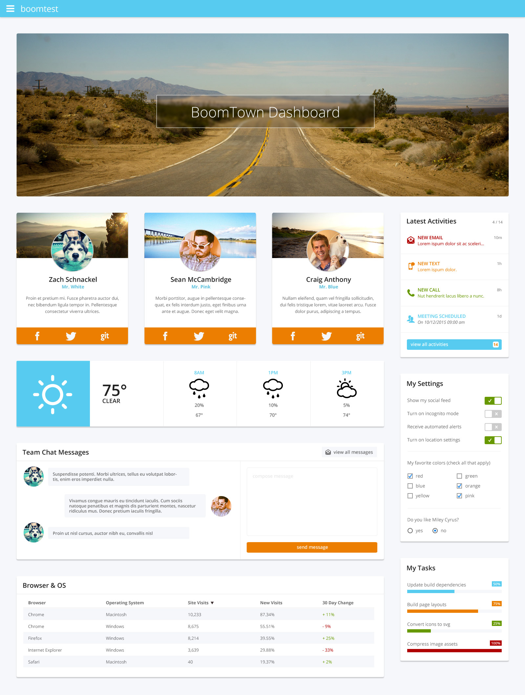
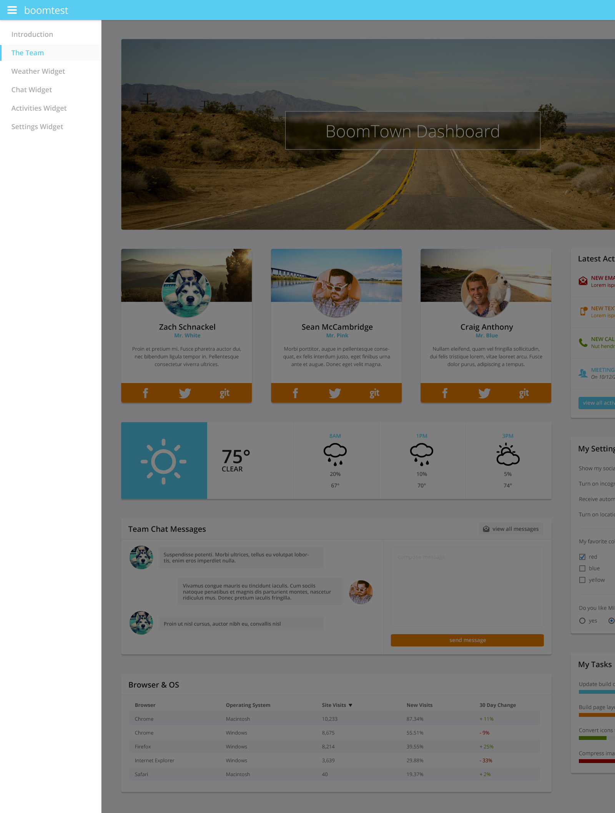

#BoomTown Front-End Developer Test

## Task
Mock-up the attached dashboard UI. Treat this project the same as if you were handing over to a client for production. Once given access to this repo, you have **48 hours** to complete this project. Any commits to your repo after that will not be accepted.

## Assets
This repo contains an `assets/` directory which will give you everything you need.

* `project.png`: Screen shots of the finished project. We realize they're not PSDs, but believe you can gather all you need. `project-navigation.png` shows an example off-canvas navigation we'd like you to mock-up as well.
* `images/`: Used for backgrounds and avatars.
* `icons/`: Used to construct reusable vector sets.

## Tools
We expect all candiates to use the following:

* [Bower](http://www.bower.io) to install project dependencies. 
* [NPM](https://www.npmjs.org/) to install packages used for build tasks.
* [Gulp](http://gulpjs.com/) or [Grunt](http://gruntjs.com/) to write project build tasks.
* [LESS](http://lesscss.org/) or [SASS](http://sass-lang.com/) (we prefer LESS).
* A CSS/JS framework like [Bootstrap](http://getbootstrap.com/), [UIkit](http://getuikit.com), or [Foundation](http://foundation.zurb.com/) to demonstrate your understanding of frameworks and your ability to integrate the framework in your project’s build process.
* [GitHub](http://github.com) as your Git repo hosting service.
* [GitHub Pages](https://pages.github.com/) to demo your completed project.

## Requirements
A few odds 'n ends that make us happy.

* It’s 2014, use HTML5.
* It’s also still 2011 for some folks. Be sure IE9 users get at least a C-grade experience. Use any polyfills you deem necessary. Progressive enhancement is your friend. 
* Make it responsive or adaptive. Actual breakpoints are up to you.
* Write CSS and HTML in a modular, scalable fashion. 
* Be consistent with spacing/indenting in your code and naming conventions across your project’s assets.
* Generated CSS and Javascript files should be compressed/minimized/optimized.
* Only use provided image assets. These may be used to create or build additional assets if necessary - such as a sprite. Under no circumstances should a NEW image asset be created.

## Final Thoughts
We aren’t looking for pixel perfect design, but do expect attention to detail. We want to see how you approach the challenge and execute the finished product.

## Screens

